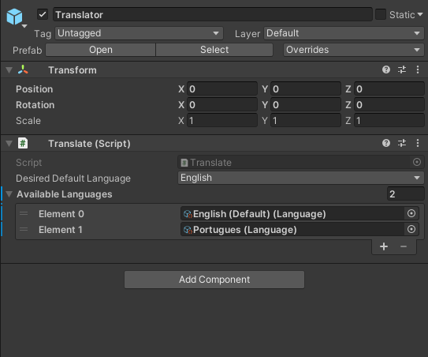
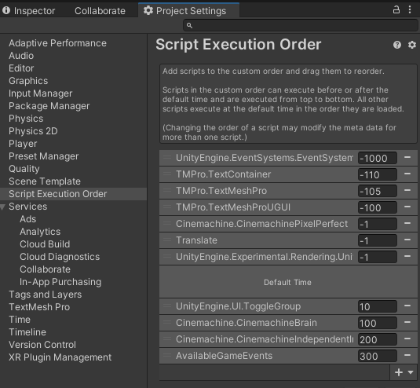

# Unity_LocalizationSystem

Easy way to implement new languages to use in your projects! Based on scriptable objects! This approach doesn't use text files, you can create your dictionary inside Unity!

## Features:
- Easy to use.
- Ready for changing languages in game.
- Add multiple languages.
- OnLanguageChange call to update active texts.

## Why use static approach
- It only calls for resources once to create the dictionary, loading only texts
- Doesn't need to be created on Awake().
- Way better for development as you won't need to run the project from initial load screen.
- Monobehaviours should be fine for very small projects though, you choose :D.

## How to setup static approach:
- Create a language in your project.
- Create and place them in "Resources/Language"

### SetUp your default language
- Set up it's texts along with the keys that will be used to track translations.

### Create other languages
- Select the desired language.
- Copy the keys from your default language and update the texts to match the new language.

### SetUp your default language
- You don't need to reference the Scriptable Objects as the system will automatically get them from the resources folder.
- You'll have to manually write your default language (currently set to english) in Translate.cs

### Using Translator
- Attatch the Translator_UI_Text to a text object and write down the desired key.

### Done

   . 
   . 
   . 
   . 
   . 
   . 
   . 
   . 

## How to setup Monobehaviour:

- First you'll need to place the script in an object thats located in the <strong>first scene</strong> of your game! There's a prefab included for this if you want.

### Create a language
- Create a language in your project.

### SetUp your default language
- Set up it's texts along with the keys that will be used to track translations.

### Create other languages
- Select the desired language.
- Copy the keys from your default language and update the texts to match the new language.

### Assing the languages to the translator
- Select the desired default language. (It will be used if a key is not found in another language or if the translator doesn't have the system language).
- Assign the languages to the translator.

### Using Translator
- Attatch the Translator_UI_Text to a text object and write down the desired key.

### Done

### Obs (ONLY FOR MONOBEHAVIOUR):
- Unity might be weird sometimes and execute some "OnEnable"s before some "Awake"s.
- This can cause errors if you want to translate Texts in the <strong>first scene</strong> of your project.
- But this can be easily fixed.

### How to fix:

- Go to "Project Settings/Script Execution Order" and place the translate script with a -1. That will fix your problems :D

