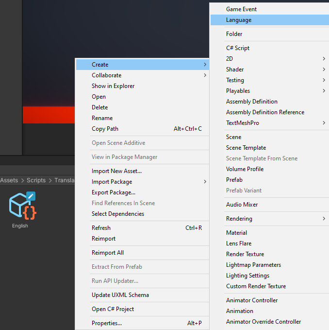
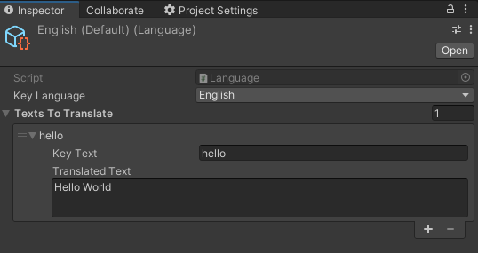
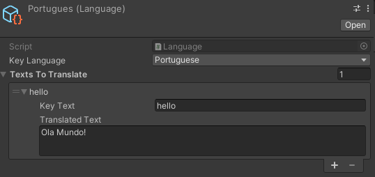
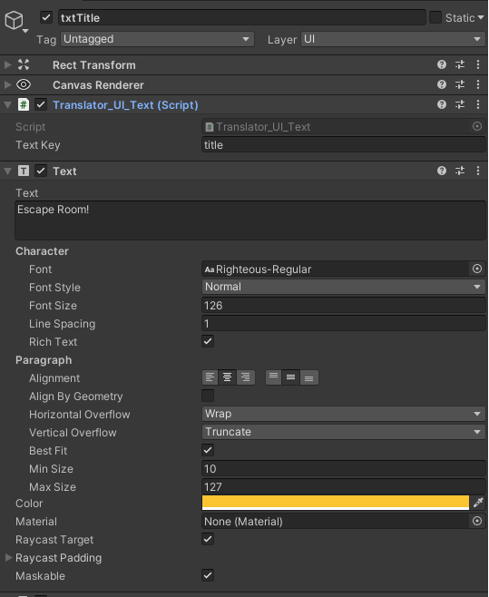
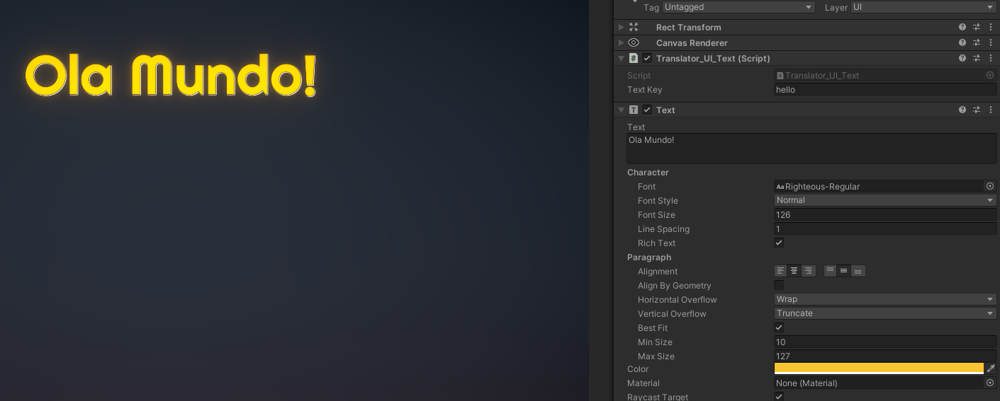

# Unity_LocalizationSystem

Easy way to implement new languages to use in your projects! Based on scriptable objects! This approach doesn't use text files, you can create your dictionary inside Unity!

## Features:
- Easy to use.
- Ready for changing languages in game.
- Add multiple languages.
- OnLanguageChange call to update active texts.

## How to setup static approach:
- Create a language in your project.
- Create and place them in "Resources/Language"

### SetUp your default language
- Set up it's texts along with the keys that will be used to track translations.

### Create other languages
- Select the desired language.
- Copy the keys from your default language and update the texts to match the new language.

### SetUp your default language
- You don't need to reference the Scriptable Objects as the system will automatically get them from the resources folder.
- You'll have to manually write your default language (currently set to english) in Translate.cs

### Using Translator
- Attatch the Translator_UI_Text to a text object and write down the desired key.

### Done
